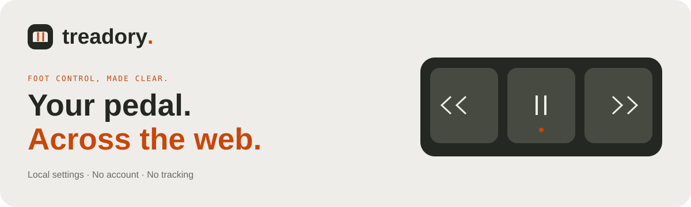

<p align="center"></p>

<p align="center"><strong>Hands free. Full control.</strong><br>A local foot-pedal workbench and a compact browser extension.</p>

<p align="center"><a href="#get-started">Get started</a> · <a href="docs/EXTENSION.md">Extension guide</a> · <a href="#computer-wide-windows-preview">Computer-wide control</a> · <a href="https://treadory.netlify.app/privacy/">Privacy</a> · <a href="docs/DEVICE-PROGRAMMING.md">Device programming</a></p>

**Website:** [treadory.netlify.app](https://treadory.netlify.app/) · **Privacy policy:** [treadory.netlify.app/privacy/](https://treadory.netlify.app/privacy/)

Treadory helps you understand what your USB pedal sends, assign each physical control, and take those mappings to the websites you allow. The cream, charcoal and burnt-orange interface keeps advanced tools tucked away until you need them. No account, backend, analytics or remote fonts.

| Website | Browser extension |
| --- | --- |
| Choose your model; learn accessible raw inputs | Connect a readable USB pedal once |
| Simulate pedals without hardware | Left, middle, right and optional fourth control |
| Diagnose inputs in one compact dialog | Scroll, media, tabs, navigation and site buttons |
| Last 50 presses with computer timestamps | Default mappings plus per-site overrides |
| Model-specific hardware programming guidance | Optional access to one site or all normal websites |
| Limited checked PCsensor programming flow | Pause, learn inputs, export and import settings |

## Get started

Requires Node.js 22+ and Python 3 for packaging.

```sh
git clone https://github.com/RonitGandotra05/treadory.git
cd treadory
npm ci
npm run dev
```

Open the local URL printed by Vite (normally `http://127.0.0.1:5173`). Stop it with **Ctrl+C**. The website’s **Demo / Simulate** mode works without hardware.

### Install the extension

Open [Treadory on Chrome Web Store](https://chromewebstore.google.com/detail/treadory-%E2%80%94-foot-pedal-con/kkgfhpnkicjkkiignanfgceldfhlicfl) and choose **Add to Chrome**. No ZIP download or Developer mode is needed for normal installation.

1. Disconnect the pedal from the website. Open the extension and choose **Browser websites** under Control mode.
2. Choose **Connect**, then **Choose USB pedal** in the setup tab, authorize its readable USB interface, and click **Done**.
3. Allow the current website or all normal websites, choose each pedal’s action, and save.
4. Close the popup and release all pedals once. Mappings follow the active tab while the browser is focused.

Use **Learn pedal inputs** when controls need assigning or reassignment. Learning saves how Treadory interprets the input; it does not reset the pedal or rewrite its firmware. Browser websites needs no native helper and does not suppress an extra operating-system mouse click.

For normal desktop-app actions or selective replacement of a supported pedal’s original outputs, choose **Computer-wide** and follow the [Windows helper setup](native/windows/README.md). The mode opens explicit setup; it never captures a device automatically. Choosing Browser websites disconnects the helper, restores original pedal input and lets you reconnect USB for browser actions.

If presses appear but actions do not run, close the popup, release every pedal, then press on an allowed website. Reopen **Settings & help → Copy diagnostics** and share that report. It includes the last 50 press outcomes and failure categories, without website URLs, page content, device names, custom text, selectors or shortcut keys. Scroll diagnostics include requested and observed movement; a completed scroll means the position changed. Reports stay in memory and are never uploaded automatically.

Chrome requires **117+** and readable USB pedal input. Firefox and Safari lack the required WebHID API. Compatible Edge/Brave browsers and physical pedals still need manual verification; development QA used virtual HID and WebKit.

`public/downloads/treadory-extension.zip` is the generated package for a **maintainer’s Chrome Web Store update**, not the website’s user-install route. The website directs users to the Store listing above. Source builds can still be loaded unpacked for development; see the [extension guide](docs/EXTENSION.md). A Git push updates the website through hosting but does not upload or publish an extension update in the Store. If the installed Store version lacks Computer-wide control, it needs a companion-enabled extension release before connecting the helper.

## What support means

- Known VEC Infinity and selected X-keys XK-3 raw HID modes have identity-checked decoders. Other readable USB pedals can be learned using stable press/release reports.
- Keyboard/mouse-only, Bluetooth keyboard, analog, MIDI and gamepad pedals cannot be identified as a specific pedal by this implementation. They need a suitable desktop bridge or another adapter.
- Browser mappings control the **active permitted website**, not desktop applications. Protected browser pages, extension stores and inaccessible cross-origin players are excluded. Website shortcuts and element clicks are simulated; sites may ignore them.
- Browser mode does **not** rewrite stored outputs or suppress OS clicks. The optional Windows helper preview can consume original mouse-class input from one uniquely identified VEC endpoint and perform configured computer-wide actions. Correct conflicting utility mappings first; no matching endpoint means this backend cannot suppress the click. See [computer-wide feasibility](docs/INPUT-ARCHITECTURE.md) and [Windows setup and recovery](native/windows/README.md).
- The website has a separate, narrowly checked PCsensor hardware programming flow. Other models receive manufacturer-specific guidance. Input decoder support does not establish device programmability. See [programming support](docs/DEVICE-PROGRAMMING.md).

## Build and verify

```sh
npm run build
npm test
npm run preview
```

The build creates the static website in `dist/`, the unpacked Manifest V3 extension in `dist-extension/`, and the upload ZIP. CI verifies production assets, package paths and permission boundaries. Portable native-mode fixtures are in `verification/`; local browser screenshots and test output are excluded from this public repository.

Settings stay in the website’s localStorage or the extension’s local storage. Their formats are separate; neither silently overwrites the other. USB permission must be granted separately. Press history stays in memory and is cleared when its page or worker restarts. Exported settings may contain your custom text and website presets—review them before sharing. Read the [privacy policy](docs/PRIVACY.md).

### Deploy the website

Deploy `dist/` to a static HTTPS host. For public search metadata, set your actual domain when building:

```sh
VITE_SITE_URL=https://your-real-domain.example/ npm run build
```

Replace that example with the real URL. The build prerenders HTML and generates canonical, sharing and sitemap URLs only when a valid public domain is supplied. The generated `robots.txt` allows public pages and rendering assets, and points to the canonical sitemap. `agents.txt` is an optional public product reference, not a Google indexing requirement. Hosting serves download/reference files with `X-Robots-Tag: noindex` and redirects duplicate index-file URLs. SEO build checks validate rendered content and metadata; see [SEO setup and Search Console verification](docs/SEO.md). Submit the sitemap through Search Console after deployment. Localhost is not searchable, and indexing/rankings cannot be guaranteed.

## Inside the project

| Path | Purpose |
| --- | --- |
| `src/` | React workbench, shared HID decoding, calibration and device support |
| `extension/` | Compact popup, background USB reader and website actions |
| `scripts/` | Static prerendering, reproducible ZIP packaging and release checks |
| `docs/` | Support boundaries, privacy, installation and technical references |
| `.github/workflows/build.yml` | Production build checks and packaged extension artifact |

The extension follows Chrome’s documented [WebHID service-worker flow](https://developer.chrome.com/docs/extensions/how-to/web-platform/webhid): user authorization in the popup, authorized input reading in the worker. Website access is [optional and requested by the user](https://developer.chrome.com/docs/extensions/develop/concepts/declare-permissions). No remote executable code or telemetry is included.

<p align="center"><sub>Your pedal. Your preference. Local first.</sub></p>

## Automatic hosting

The production site is a static Netlify deployment linked to this repository through Netlify’s GitHub App. Each push to `main` runs `npm run build && npm test` and publishes only after those checks pass. GitHub Actions separately verifies pull requests and offers a manual check. Netlify deploy previews and branch deploys are disabled. There are no server functions, paid analytics or duplicate GitHub builds on pushes to `main`.

Deployment configuration is in `netlify.toml`, including the real public URL for canonical metadata and the sitemap. No Netlify credential is stored in GitHub. Netlify’s production-deployment and traffic usage remain subject to the team’s plan; automatic deployments cannot eliminate per-production-deploy credits on credit-based plans.

## Computer-wide Windows preview

The extension now includes **Computer-wide control**. It uses an opt-in native-messaging helper rather than an Electron/Tauri shell. Read-only endpoint inspection needs no driver. Replacement actions use a separately installed, appropriately licensed Interception driver. No driver or Interception DLL is redistributed. Only a unique VEC `05f3:00ff` mouse endpoint is eligible. Three physical controls must be learned before actions can be activated. No timing-based or global right-click suppression is used.

On the website, choose **Computer-wide control · Windows preview** beneath the main Connect/Demo controls, or choose **System-wide** in the shared control-mode card below your mappings. **Website-wide** sits beside it in the same card and links to the Chrome Web Store. The **Test & fix pedal → Device outputs** flow also links there for the VEC model. The section provides the Windows preview ZIP, source/setup ZIP, installation steps and support limitations. The URL fragment `/#computer-wide` opens it directly. The download is a ZIP containing `host/treadory-helper.exe`, PowerShell setup/removal scripts and a README, rather than a double-click installer. Extract All, install the .NET 10 x64 Runtime, and run `install.ps1` with the Store extension ID for read-only inspection. Replacement requires separate driver setup and reinstalling with the verified x64 DLL as described in the included README. The website shows these installation steps before users choose **Computer-wide** under Control mode in the extension.

Normal website builds include the versioned Windows x64 executable snapshot under `native/windows/distribution/win-x64`; Netlify does not need .NET installed or untracked local build files to serve the download. Packaging checks its source and binary SHA-256 hashes and refuses a stale or modified snapshot. To update native code, publish it with .NET 10, run `npm run build:helper-snapshot`, then `npm run build` and commit the refreshed snapshot with its source. An explicit `TREADORY_HELPER_DIR` override may package a separate development build; a missing override directory offers only the source ZIP.

The preview executable requires the .NET 10 x64 Runtime. Endpoint inspection needs no driver; replacement additionally requires the separately licensed and installed Interception driver/DLL. Windows installer/native behavior and the physical IN-USB-3 still require testing on the affected computer. Mac/Linux suppression backends and signed production installers are not included. A local commit alone does not publish the website; the hosting workflow runs after a push to `main`.

Stop/disconnect, Ctrl+Alt+Shift+F12, heartbeat loss, device changes and host/browser exit release capture. Pausing chosen actions keeps original pedal input suppressed; stopping capture restores it. Browser mode and native mode cannot read/run actions concurrently. Pure safety tests run with `npm test` and `npm run test:native`; the Windows workflow also checks the actual executable and install/remove scripts. No production/hardware verification is inferred from those tests.

See the [verification record and remaining release gates](docs/INPUT-VERIFICATION.md) for checks actually run and those still requiring Windows hardware.
